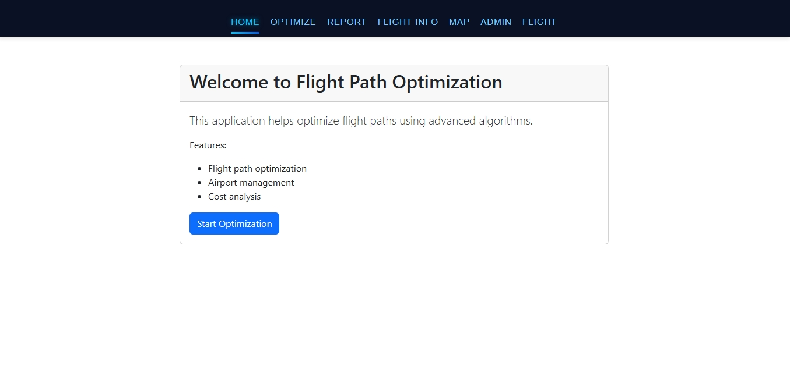
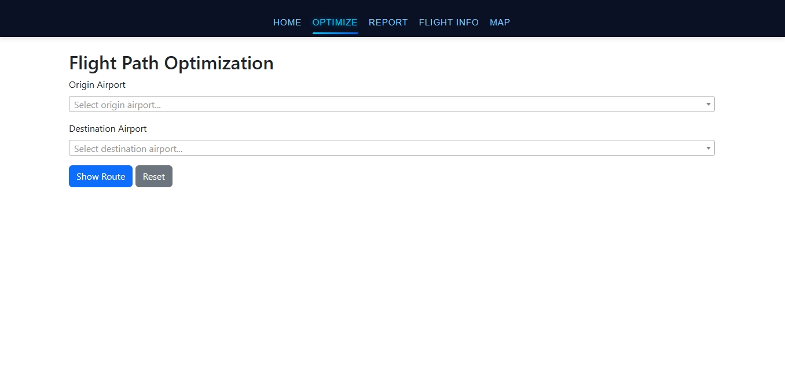
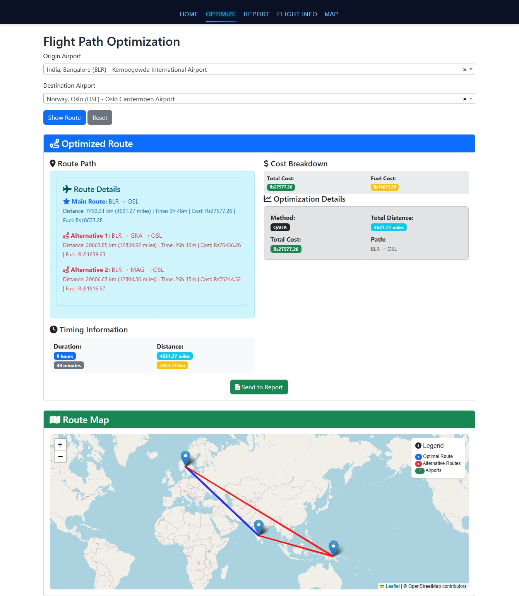
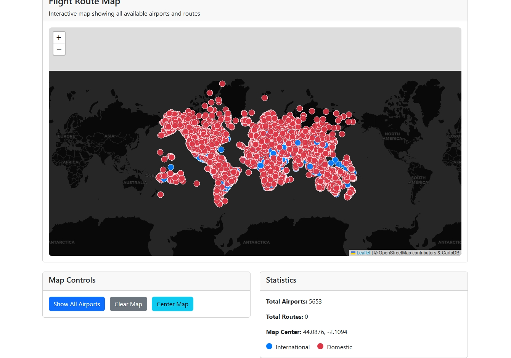
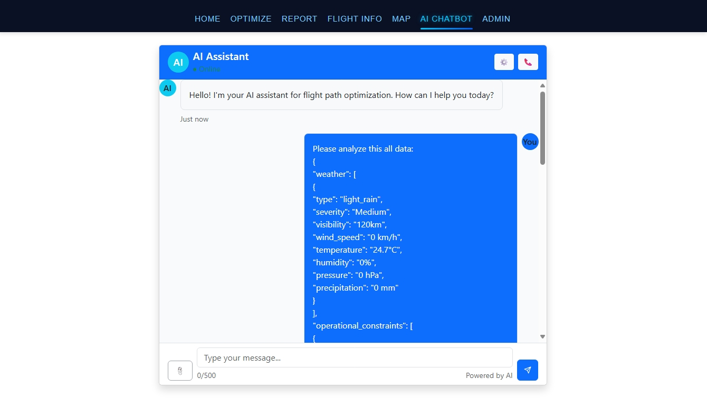
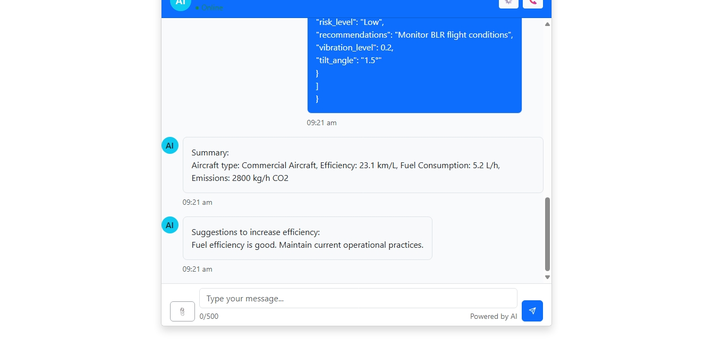

# Flight Path AI Project

# Badges


# Screenshots
Below are some screenshots of the Flight Path AI Project web interface and features:


*Home Page: Main dashboard for flight path AI project.*



*Flight Optimization: Interface for optimizing flight routes.*


*Map Visualization: Interactive map showing flight paths and airports.*



*Chatbot (Gemini AI): AI-powered assistant for user queries.*

> To add your own screenshots, place image files in `static/img/` and update the paths above as needed.

## Overview
Flight Path AI is a comprehensive platform for optimizing and analyzing flight routes using AI and advanced algorithms. It integrates airport data, flight information, and machine learning models to provide efficient flight path predictions and operational insights.

## Features
- **Flight Path Optimization**: Uses QAOA and other optimizers for route planning.
- **Airport Data Integration**: Supports cleaned and location-based airport datasets.
- **AI Model Integration**: Predicts flight angles and paths using trained Keras models.
- **Supabase Integration**: Manages data storage and retrieval with Supabase.
- **Web Interface**: Interactive web pages for flight info, optimization, reports, and chatbot.
- **Gemini AI Chatbot**: Integrated Gemini AI for intelligent chatbot interactions.
- **Visualization**: Map-based visualization of flight paths and airport locations.

## Folder Structure

```
Flight/
├── FILGHT/                      # Main Django app
│   ├── __init__.py
│   ├── admin.py
│   ├── air_id_example.py
│   ├── api_utils.py
│   ├── asgi.py
│   ├── models.py
│   ├── optimizer.py
│   ├── qaoa_optimizer.py
│   ├── serializers.py
│   ├── settings.py
│   ├── supabase_utils.py
│   ├── urls.py
│   ├── views.py
│   ├── wsgi.py
│   ├── migrations/              # Database migrations
│   ├── templates/               # HTML templates
│   │   ├── base.html
│   │   ├── chat_bot.html
│   │   ├── flight_info.html
│   │   ├── flight.html
│   │   ├── home.html
│   │   ├── map.html
│   │   ├── optimize.html
│   │   ├── report.html
│   ├── static/                  # Static files
│   │   ├── css/
│   │   │   ├── airport_dropdown.css
│   │   │   ├── chat_bot.css
│   │   │   ├── flight.css
│   │   │   ├── map.css
│   │   │   ├── navbar.css
│   │   │   ├── optimize.css
│   │   │   ├── report.css
│   │   ├── js/
│   │   ├── data/
│   │   │   ├── ACC_flights.json
│   │   │   ├── api_flight.json
│   │   │   ├── ...
│   │   ├── img/
│   │   │   ├── home.jpeg
│   │   │   ├── empty_optimization.jpeg
│   │   │   ├── optimization.jpeg
│   │   │   ├── map.jpeg
│   │   │   ├── chat_bot_1.jpeg
│   │   │   ├── chat_bot_2.jpeg
│   │   │   ├── ...
├── flight_path_ai_project/      # AI and ML scripts
│   ├── plane_env.py
│   ├── pridict_path.py
│   ├── train_model.py
├── airports_cleaned.json        # Cleaned airport data
├── airports_locations.json      # Airport location data
├── db.sqlite3                   # SQLite database
├── requirements.txt             # Python dependencies
├── pyproject.toml               # Project configuration
├── README.md                    # Project documentation
├── SUPABASE_SETUP.md            # Supabase setup instructions
├── supabase_tables.sql          # Supabase table definitions
├── qaoa_angle_predictor.keras   # Trained Keras model
├── uv.lock                      # uv package lock file
└── ...
```

## Setup Instructions
1. **Clone the repository**
   ```cmd/Terminal
   git clone s<repo-url>
   cd Flight
   ```
2. **Install dependencies**
   ```cmd/Terminal
   uv sync 
   ```
3. **Apply migrations**
   ```cmd/Terminal
   uv run python manage.py migrate
   ```
4. **Run the development server**
   ```cmd/Terminal
   uv run python manage.py runserver
   ```

## Usage
- Access the web interface at `http://localhost:8000/`
- Use the chatbot (powered by Gemini AI), flight optimizer, and map visualizations via the provided HTML templates.
- Integrate new airport or flight data by updating the JSON files and running import scripts.

## AI & Optimization
- Train models using scripts in `flight_path_ai_project/`
- Use `qaoa_angle_predictor.keras` for flight angle predictions
- Optimize flight paths with `qaoa_optimizer.py` and related modules

## Supabase Integration
- See `SUPABASE_SETUP.md` and `supabase_tables.sql` for database setup and table definitions

## Contributing
Pull requests and issues are welcome! Please follow standard Python and Django best practices.

## License
This project is licensed under the MIT License.

## Contributors
- anushak1815
- mr unknown
- GitHub Copilot (AI Assistant)

## FAQ
**Q: What Python version is required?**
A: Python 3.10 or higher is recommended.

**Q: How do I add new airport data?**
A: Update the JSON files and use the import scripts provided.

**Q: Who maintains the chatbot?**
A: The chatbot is powered by Gemini AI and maintained by the project contributors.

## Technologies Used
- Python 3.10+
- Django
- Keras
- Supabase
- Gemini AI
- uv (Python package manager)

## API Documentation
The project exposes several REST API endpoints for flight data, optimization, and airport information. See `FILGHT/api_utils.py` and `FILGHT/views.py` for details.

## Contact
For support or questions, open an issue or contact the contributors via GitHub.

## Changelog
- v1.0 Initial release with flight optimization, AI integration, and Supabase support.

## Acknowledgements
- Gemini AI for chatbot functionality
- Supabase for database management
- Django and Keras communities
